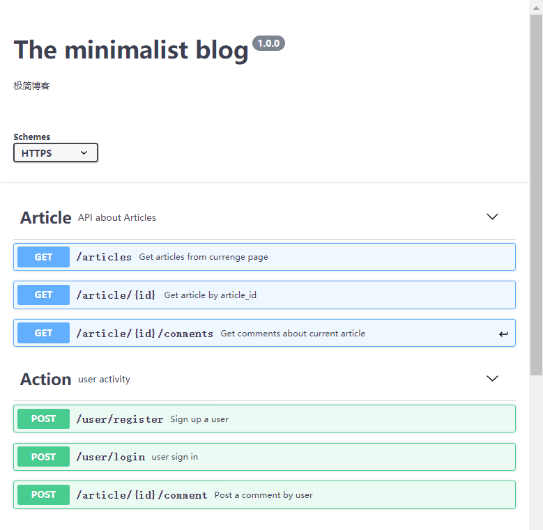
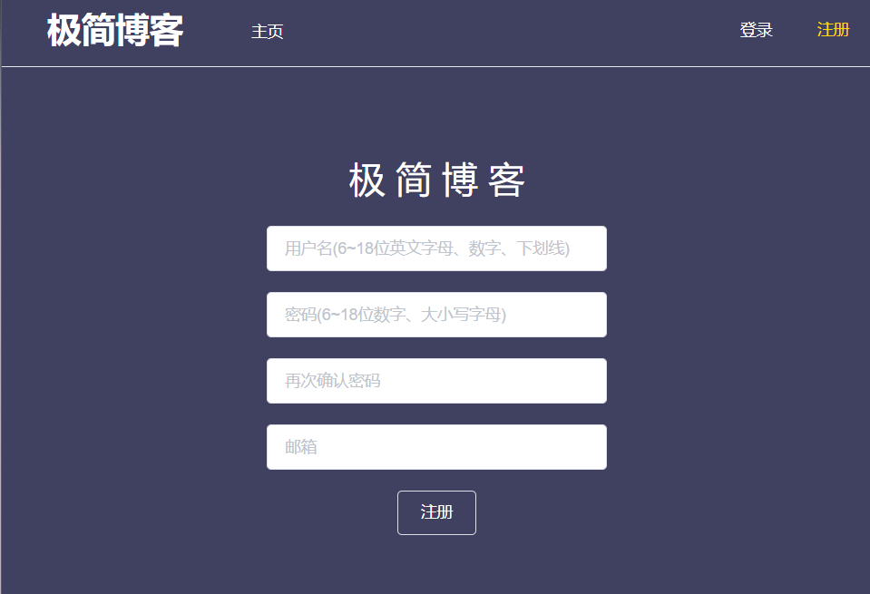
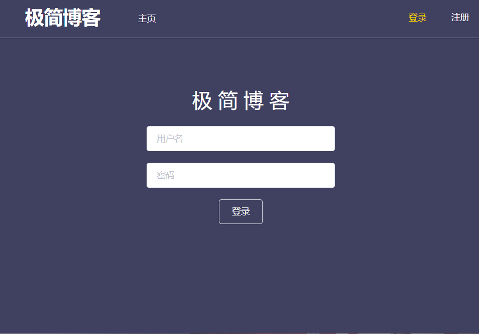

# 简单web服务与客户端开发实战

### 小组成员

- 张楚明 18342125 [web客户端开发](https://blog.csdn.net/try17875864815/article/details/111414404)

- 殷睿 18342122 [web服务器开发](https://blog.csdn.net/weixin_43978568/article/details/111467440)

### Features

- 注册登录
- 发布文章
- 评论文章
- **Token认证**

### API

### 成果展示

- 注册界面

- 登录界面

